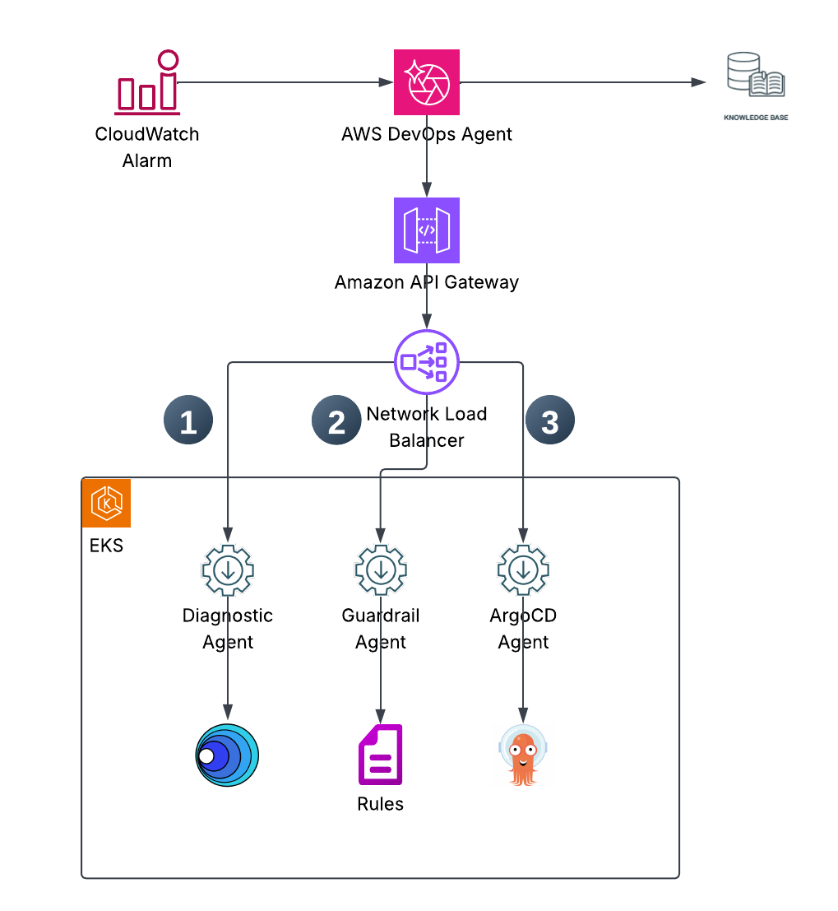
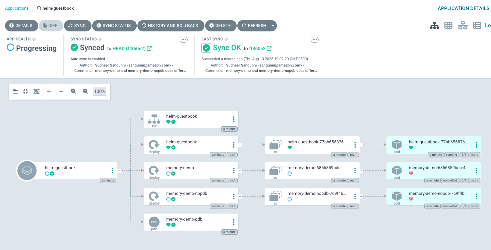
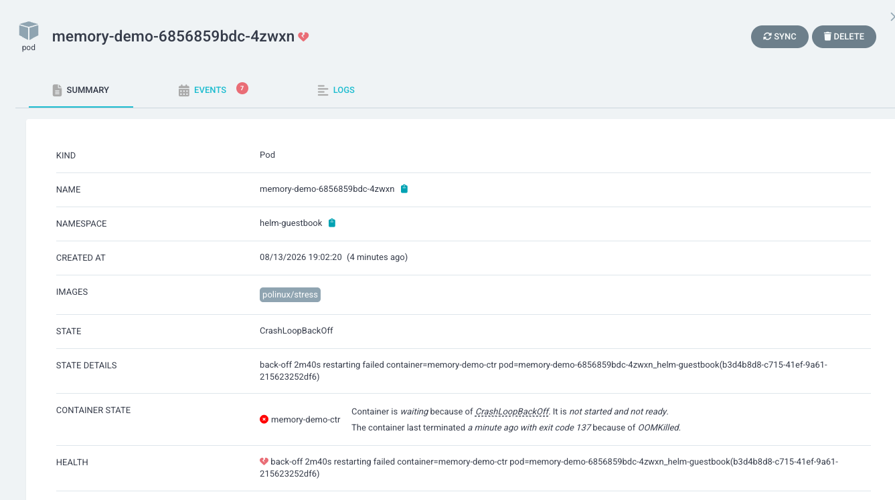
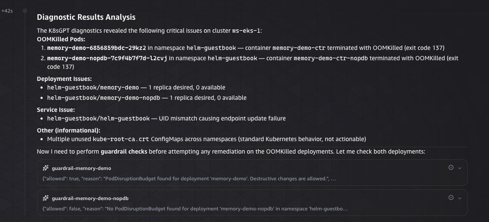
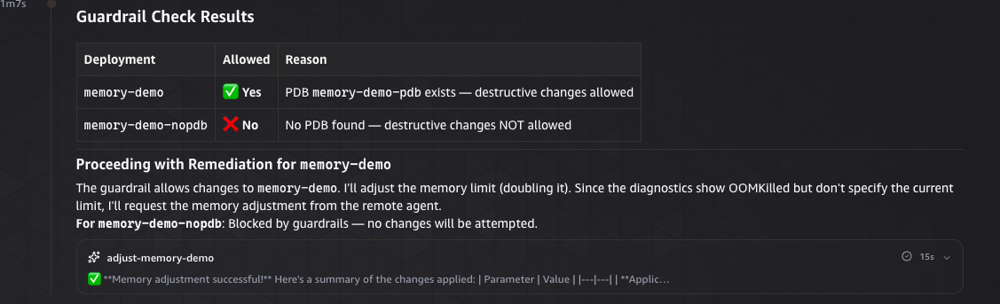
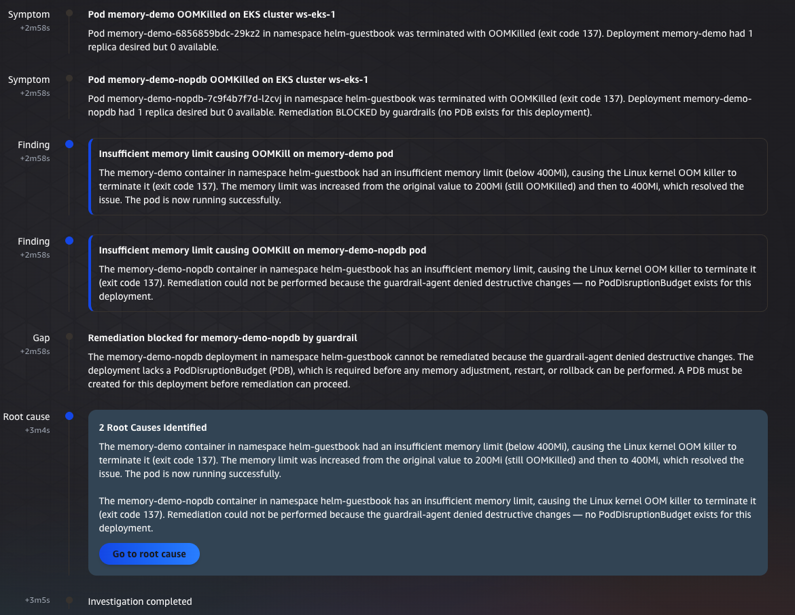

# Controlled self-healing EKS with AWS DevOps Agent and A2A remote agents

## 1. Introduction

In a [previous post](https://aws.amazon.com/blogs/machine-learning/automate-amazon-eks-troubleshooting-using-an-amazon-bedrock-agentic-workflow/), we demonstrated how to orchestrate multiple Amazon Bedrock agents to create an Amazon EKS troubleshooting system. That solution used Amazon Bedrock multi-agent collaboration to coordinate a K8sGPT diagnostic agent and an ArgoCD remediation agent, enabling automated identification and resolution of cluster issues.

In this post, we take that solution further by integrating customer-built remote agents with [AWS DevOps Agent](https://docs.aws.amazon.com/devopsagent/latest/userguide/) using the [Agent-to-Agent (A2A) protocol](https://a2a-protocol.org/). Rather than relying solely on built-in capabilities, customers can bring their own specialized agents — built with their preferred frameworks, deployed in their own infrastructure — and connect them directly into the DevOps Agent's troubleshooting and remediation workflow.

We demonstrate this with two customer-built agents:
- **ArgoCD operations agent** — Runs K8sGPT diagnostics on the EKS cluster and performs remediation actions (memory adjustments, restarts, rollbacks) through ArgoCD
- **Guardrail agent** — Validates safety conditions (Pod Disruption Budget existence) before any destructive change is permitted

The result is a controlled self-healing system where the DevOps Agent orchestrates the investigation, custom agents handle domain-specific operations, and guardrail agents enforce safety policies — all communicating through the standard A2A protocol.

## 2. Solution Overview

The architecture consists of the following components:

- **AWS DevOps Agent** — Receives CloudWatch alarms, initiates investigations, and orchestrates the troubleshooting workflow by delegating tasks to remote agents
- **ArgoCD remote agent (customer-built)** — A FastAPI A2A server deployed on EKS that queries K8sGPT for cluster diagnostics and manages ArgoCD applications (sync, rollback, memory adjustment) via Kubernetes CRDs
- **Guardrail remote agent (customer-built)** — A FastAPI A2A server deployed on EKS that checks Pod Disruption Budget existence for deployments before allowing destructive changes
- **Amazon API Gateway + VPC Link** — Provides a trusted HTTPS endpoint for the DevOps Agent to reach the customer agents running inside the EKS cluster
- **Internal Network Load Balancer** — Routes traffic from API Gateway to agent pods via VPC Link
- **Amazon EKS with ArgoCD capability** — The target cluster running workloads managed by ArgoCD with K8sGPT operator for diagnostics

**Investigation workflow:**
1. CloudWatch alarm triggers an AWS DevOps Agent investigation
2. DevOps Agent reads the EKS troubleshooting skill
3. DevOps Agent calls the ArgoCD agent to retrieve K8sGPT diagnostics
4. If OOMKilled pods are found, DevOps Agent calls the guardrail agent to check PDB for the affected deployment
5. If guardrails allow, DevOps Agent calls the ArgoCD agent to double the memory limit
6. DevOps Agent verifies the fix by re-running diagnostics
7. Investigation report is generated with findings, actions taken, and any changes blocked by guardrails



## 3. Prerequisites

Before starting, ensure you have the following in place:

- An AWS account with appropriate permissions
- [AWS CLI v2](https://docs.aws.amazon.com/cli/latest/userguide/getting-started-install.html) installed and configured
- An Amazon EKS cluster (this post uses cluster name `ws-eks-1` in `us-east-1`)
- [kubectl](https://kubernetes.io/docs/tasks/tools/) configured for your cluster
- [finch](https://github.com/runfinch/finch) or Docker for container builds
- Amazon Bedrock model access (Anthropic Claude Sonnet and Amazon Nova Lite) in your deployment region
- [ArgoCD EKS capability](https://docs.aws.amazon.com/eks/latest/userguide/create-argocd-capability.html) installed on the cluster
- [K8sGPT operator](https://docs.k8sgpt.ai/getting-started/installation/) installed on the cluster (see setup steps below)
- AWS DevOps Agent access in your account
- The solution from the [previous blog post](https://aws.amazon.com/blogs/machine-learning/automate-amazon-eks-troubleshooting-using-an-amazon-bedrock-agentic-workflow/) as a reference

### Enable ArgoCD Capability on EKS

Follow the [Create an Argo CD capability](https://docs.aws.amazon.com/eks/latest/userguide/create-argocd-capability.html) guide to enable the managed ArgoCD capability on your EKS cluster. This provides a fully managed GitOps deployment tool with IAM Identity Center authentication.

### Install K8sGPT Operator

Install the K8sGPT operator on your EKS cluster to enable AI-powered cluster diagnostics:

1. Set up the EKS cluster name and create necessary namespaces:
```bash
export EKS_CLUSTER=ws-eks-1
export AWS_REGION=us-east-1

kubectl create ns helm-guestbook
kubectl create ns k8sgpt-operator-system
```

2. Add the K8sGPT Helm repository:
```bash
helm repo add k8sgpt https://charts.k8sgpt.ai/
helm repo update
```

3. Install the K8sGPT operator:
```bash
helm install k8sgpt-operator k8sgpt/k8sgpt-operator --namespace k8sgpt-operator-system
```

Verify the operator is running:
```bash
kubectl get pods -n k8sgpt-operator-system
```

4. Create the K8sGPT custom resource configured with Amazon Nova Lite:
```bash
echo "
apiVersion: core.k8sgpt.ai/v1alpha1
kind: K8sGPT
metadata:
  name: k8sgpt-bedrock
  namespace: k8sgpt-operator-system
spec:
  ai:
    enabled: true
    model: us.amazon.nova-lite-v1:0
    region: $AWS_REGION
    backend: amazonbedrock
    language: english
  noCache: false
  repository: ghcr.io/k8sgpt-ai/k8sgpt
  version: v0.4.36
" | kubectl apply -f -
```

5. Set up EKS Pod Identity for K8sGPT to access Amazon Bedrock:
```bash
eksctl create podidentityassociation \
  --cluster $EKS_CLUSTER \
  --namespace k8sgpt-operator-system \
  --service-account-name k8sgpt-k8sgpt-operator-system \
  --role-name k8sgpt-app-eks-pod-identity-role \
  --permission-policy-arns arn:aws:iam::aws:policy/AdministratorAccess \
  --region $AWS_REGION
```

6. Restart the K8sGPT pods so Pod Identity takes effect:
```bash
kubectl -n k8sgpt-operator-system rollout restart deploy
```

7. Verify K8sGPT is running and producing results:
```bash
kubectl get pods -n k8sgpt-operator-system
kubectl get results -n k8sgpt-operator-system
```

You should see both the `k8sgpt-bedrock` pod and the `k8sgpt-operator-controller-manager` pod running. The K8sGPT operator continuously analyzes cluster health and stores diagnostic results as Kubernetes custom resources. The ArgoCD remote agent queries these results to provide diagnostics to the DevOps Agent.

## 4. Setup and Solution Steps

> **Note:** If you already have agents running that AWS DevOps Agent can reach via the A2A protocol — for example, an existing diagnostics agent or a guardrail agent your team maintains — you can reuse those instead of deploying the ArgoCD agent and guardrail agent described below. The agents in this walkthrough are only needed if you don't already have remote agents that provide equivalent capabilities. Any A2A-compatible agent works as long as it satisfies the requirements in [Connecting Remote A2A Agents](https://docs.aws.amazon.com/devopsagent/latest/userguide/configuring-integrations-and-knowledge-connecting-remote-a2a-agents.html) — namely, serving a valid agent card with `name`, `description`, `supportedInterfaces`, `capabilities`, and `skills`, and supporting one of the accepted authentication methods (API key, bearer token, OAuth client credentials, or AWS SigV4). If you have existing agents that meet these requirements, skip directly to [4.6 Register Remote Agents in AWS DevOps Agent](#46-register-remote-agents-in-aws-devops-agent).

### 4.1 Download the Solution Source

Clone the sample repository and change into the `a2a` directory, which contains the remote agents (ArgoCD and guardrail), the Kubernetes manifests, and the deployment scripts used throughout the rest of this walkthrough. All subsequent commands are run from this directory.

```bash
git clone https://github.com/aws-samples/Amazon-prometheus-bedrock-agent-example
cd Amazon-prometheus-bedrock-agent-example/a2a
```

The `a2a` directory contains:
- `app/argocd_agent_eks/` and `app/guardrail_agent/` — the two remote agent applications
- `k8s/` — the Kubernetes manifests (RBAC, Deployment, Service, ConfigMap) for each agent
- `deploy-argocd-eks.sh`, `deploy-guardrail-agent.sh`, and `k8s/guardrail-agent/setup-apigw.sh` — the deployment scripts

Source: [`aws-samples/Amazon-prometheus-bedrock-agent-example` → `a2a`](https://github.com/aws-samples/Amazon-prometheus-bedrock-agent-example/tree/main/a2a)

### 4.2 Deploy the ArgoCD Remote Agent on EKS

The ArgoCD agent is a FastAPI application that implements the A2A protocol and provides three skills: K8sGPT diagnostics, memory adjustment, and restart/rollback. Deploying it is a three-step sequence with `deploy-argocd-eks.sh`. Run the steps in order — each one is described below before its command.

**Step 1 — `build`:** Builds the agent container image for `linux/amd64`, creates the ECR repository if it doesn't already exist, and pushes the image to ECR.
```bash
./deploy-argocd-eks.sh build
```

**Step 2 — `deploy`:** Applies the Kubernetes manifests (namespace, service account, RBAC `ClusterRole` for ArgoCD Application CRDs and K8sGPT Results, ConfigMap, Deployment, and ClusterIP Service), creates or updates the IRSA role with the Amazon Bedrock permissions the agent needs, and waits for the deployment rollout to finish.
```bash
./deploy-argocd-eks.sh deploy
```

**Step 3 — `apigw`:** Creates the trusted HTTPS entry point for the agent — an internal Network Load Balancer (with cross-zone load balancing), a target group, a VPC Link, and the REST API — then registers the running pod's IP as the NLB target and updates the agent's `AGENT_URL` so its agent card advertises the public endpoint.
```bash
./deploy-argocd-eks.sh apigw
```

> **Note:** The `apigw` step registers the current pod IP directly with the NLB target group. If the agent pod restarts (redeploy, node change, or OOM), its IP changes — re-run `./deploy-argocd-eks.sh apigw` to register the new pod IP, otherwise requests through API Gateway will fail against the stale target.

**Verify the agent is running:**
```bash
kubectl get pods -n argocd-agent -l app.kubernetes.io/name=argocd-agent-eks
kubectl port-forward svc/argocd-agent-eks -n argocd-agent 9000:9000
curl http://localhost:9000/.well-known/agent-card.json | jq .
```

### 4.3 Deploy the Guardrail Agent on EKS

The guardrail agent validates Pod Disruption Budget existence before permitting destructive changes. It has read-only access to Deployments and PDBs.

**Build and deploy:**
```bash
./deploy-guardrail-agent.sh all
```

**Verify:**
```bash
kubectl get pods -n guardrail-agent -l app.kubernetes.io/name=guardrail-agent
kubectl port-forward svc/guardrail-agent -n guardrail-agent 9001:9001
curl http://localhost:9001/.well-known/agent-card.json | jq .
```

### 4.4 Expose the Guardrail Agent through the Shared API Gateway

The `apigw` step in section 4.2 already created the internal Network Load Balancer, VPC Link, and REST API for the ArgoCD agent. The guardrail agent reuses that same API Gateway and NLB rather than standing up its own — its setup script looks them up by name and adds a `/guardrail` route.

**Add the guardrail agent route:**
```bash
./k8s/guardrail-agent/setup-apigw.sh
```

This adds:
- A target group for the guardrail agent (port 9001) and registers its pod IP
- A listener on the shared NLB for port 9001
- A `/guardrail` path on the existing REST API, routed through the shared VPC Link

The result is path-based routing on one API Gateway: `/` reaches the ArgoCD agent and `/guardrail` reaches the guardrail agent.

**Capture the account ID and API Gateway ID as shell variables** (reused by the verification commands below and in section 4.5):
```bash
export ACCOUNT_ID=$(aws sts get-caller-identity --query Account --output text)
export API_ID=$(aws apigateway get-rest-apis --region ${AWS_REGION} \
  --query "items[?name=='argocd-eks-agent-api'].id | [0]" --output text)
```

**Verify both endpoints:**
```bash
curl https://${API_ID}.execute-api.${AWS_REGION}.amazonaws.com/prod/.well-known/agent-card.json | jq .name
curl https://${API_ID}.execute-api.${AWS_REGION}.amazonaws.com/prod/guardrail/.well-known/agent-card.json | jq .name
```

### 4.5 Create the IAM Role for DevOps Agent Authentication

The DevOps Agent uses AWS SigV4 to authenticate when calling remote agents. Create a role it can assume:

```bash
aws iam create-role \
  --role-name DevOpsAgentElevatedRoleforEKS \
  --assume-role-policy-document '{
    "Version": "2012-10-17",
    "Statement": [{
      "Effect": "Allow",
      "Principal": {"Service": "aidevops.amazonaws.com"},
      "Action": "sts:AssumeRole",
      "Condition": {"StringEquals": {"aws:SourceAccount": "'"$ACCOUNT_ID"'"}}
    }]
  }'

aws iam put-role-policy \
  --role-name DevOpsAgentElevatedRoleforEKS \
  --policy-name ApiGatewayInvoke \
  --policy-document '{
    "Version": "2012-10-17",
    "Statement": [{
      "Effect": "Allow",
      "Action": "execute-api:Invoke",
      "Resource": "arn:aws:execute-api:'"$AWS_REGION"':'"$ACCOUNT_ID"':'"$API_ID"'/*"
    }]
  }'
```

### 4.6 Register Remote Agents in AWS DevOps Agent

In the AWS DevOps Agent console:

1. Navigate to **Capability Providers** → **Remote Agent** → **Register**
2. Register the **ArgoCD agent**:
   - Name: `argocds-ekd`
   - Agent card endpoint: `https://<API_ID>.execute-api.<AWS_REGION>.amazonaws.com/prod/.well-known/agent-card.json`
   - Authentication: AWS SigV4
   - IAM Role: `DevOpsAgentElevatedRoleforEKS`
   - Region: `<AWS_REGION>` (the region you deployed to, e.g. `us-east-1`)
   - Service Name: `execute-api`

3. Register the **Guardrail agent**:
   - Name: `guardrail-agent`
   - Agent card endpoint: `https://<API_ID>.execute-api.<AWS_REGION>.amazonaws.com/prod/guardrail/.well-known/agent-card.json`
   - Authentication: AWS SigV4
   - IAM Role: `DevOpsAgentElevatedRoleforEKS`
   - Region: `<AWS_REGION>` (the region you deployed to, e.g. `us-east-1`)
   - Service Name: `execute-api`

4. Associate both agents with your Agent Space

### 4.7 Create the EKS Troubleshooting Skill

Upload the troubleshooting skill to your DevOps Agent Agent Space. The skill defines the workflow:

1. Run K8sGPT diagnostics via the ArgoCD agent
2. Check guardrails before any destructive change
3. Remediate only if guardrails approve (double memory for OOMKilled pods)
4. Verify the fix and report results

Key guardrail enforcement rules in the skill:
- Every destructive change requires guardrail approval per deployment
- If guardrails deny, the change is blocked and documented
- Rollbacks require approval for ALL deployments in the application
- If guardrail agent is unreachable, changes are blocked

The complete skill — the step-by-step investigation workflow, the exact prompts sent to each remote agent, the retry policy, and the full set of guardrail enforcement rules — is provided in [`skills/eks-troubleshooting.md`](https://github.com/aws-samples/Amazon-prometheus-bedrock-agent-example/blob/main/a2a/skills/eks-troubleshooting.md) in the solution repository. Upload that file as-is to your DevOps Agent Agent Space.

### 4.8 Deploy a Test Application with ArgoCD

Deploy a test application that includes both a guarded deployment (with PDB) and an unguarded deployment (without PDB). The manifest's `destination.name` is templated as `${EKS_CLUSTER}`, so export that variable (it should match the cluster name registered in ArgoCD, typically your EKS cluster name) and render it with `envsubst` before applying:

```bash
export EKS_CLUSTER=<your-cluster-name>
envsubst < argocd-application2.yaml | kubectl apply -f -
```

The `argocd-application2.yaml` template contains:

```yaml
apiVersion: argoproj.io/v1alpha1
kind: Application
metadata:
  name: helm-guestbook
  namespace: argocd
spec:
  project: default
  source:
    repoURL: https://github.com/ss1796/argocd-example-apps
    targetRevision: HEAD
    path: helm-guestbook
    helm:
      valueFiles:
      - values.yaml
  destination:
    name: ${EKS_CLUSTER}
    namespace: helm-guestbook
  syncPolicy:
    automated:
      prune: true
      selfHeal: true
    syncOptions:
    - CreateNamespace=true
```

The Helm chart in the sample apps repository includes both a deployment with a PDB (`memory-demo`) and a deployment without a PDB (`memory-demo-nopdb`). This demonstrates how the guardrail agent allows changes to the protected deployment while blocking changes to the unprotected one.

Once ArgoCD syncs the application, you should see the `helm-guestbook` application deployed and healthy in the ArgoCD UI:



Shortly after installation, the `memory-demo` pod exceeds its configured memory limit and is terminated by the Linux OOM killer, as shown in the ArgoCD resource view:



We will use DevOps Agent to investigate and remediate this issue.

### 4.9 Trigger an Investigation

Create a CloudWatch alarm or manually trigger an investigation in the DevOps Agent console:

1. Start a new investigation
2. Set the description:
   ```
   use eks-troubleshooting skill to identify the issues with the EKS cluster ws-eks-1 cluster in us-east-1. Do not continue if you cannot access the remote agent
   ```
3. Observe the DevOps Agent:
   - Retrieve diagnostics via the ArgoCD agent
   - Check PDB via the guardrail agent for each affected deployment
   - Adjust memory for the approved deployment
   - Block changes to the denied deployment
   - Verify and report

The DevOps Agent first retrieves K8sGPT diagnostics from the ArgoCD agent, surfacing issues like OOMKilled pods across the cluster:



Next, the DevOps Agent consults the guardrail agent before making any changes. Deployments with a Pod Disruption Budget are approved for remediation, while deployments without one are blocked:



Finally, the investigation report summarizes the findings, the actions taken, and any changes blocked by the guardrail agent:



## 5. Cleanup

Remove all resources created in this walkthrough:

```bash
# Remove agents from EKS
./deploy-argocd-eks.sh destroy
./deploy-guardrail-agent.sh destroy

# Remove API Gateway resources
# (handled by the destroy commands above)

# Remove the IAM role
aws iam delete-role-policy --role-name DevOpsAgentElevatedRoleforEKS --policy-name ApiGatewayInvoke
aws iam delete-role --role-name DevOpsAgentElevatedRoleforEKS

# Remove ECR repositories
aws ecr delete-repository --repository-name argocd-agent-eks --region ${AWS_REGION} --force
aws ecr delete-repository --repository-name guardrail-agent --region ${AWS_REGION} --force

# Deregister remote agents in DevOps Agent console
# Navigate to Capability Providers → select each agent → Deregister

# Remove test application
kubectl delete application helm-guestbook -n argocd
kubectl delete namespace helm-guestbook
```

## 6. Conclusion

In this post, we demonstrated how customers can extend AWS DevOps Agent with their own specialized remote agents for controlled self-healing of Amazon EKS workloads. By building custom A2A agents — one for ArgoCD operations and another for guardrail enforcement — and integrating them into the DevOps Agent's investigation workflow, we achieved:

- **Customer-owned agents**: The ArgoCD agent and guardrail agent are built with customer-chosen frameworks (Strands, FastAPI), deployed in customer infrastructure (EKS), and maintained independently
- **Controlled remediation**: The guardrail agent validates Pod Disruption Budget existence before any destructive change, ensuring availability requirements are respected
- **Separation of concerns**: Action agents focus on operations; guardrail agents focus on safety — the same guardrail agent can serve multiple action agents across the organization
- **Standard protocol**: A2A enables loose coupling between agents, allowing teams to build, deploy, and update agents independently

This pattern extends naturally beyond EKS troubleshooting. Customers can build remote agents for database operations, network diagnostics, security scanning, or any domain-specific operation — each with its own guardrail agent defining what changes are safe. The AWS DevOps Agent provides the orchestration layer; customers control the agents, the policies, and the infrastructure.

For the foundational EKS troubleshooting setup using Amazon Bedrock multi-agent collaboration, refer to the [previous post](https://aws.amazon.com/blogs/machine-learning/automate-amazon-eks-troubleshooting-using-an-amazon-bedrock-agentic-workflow/).
